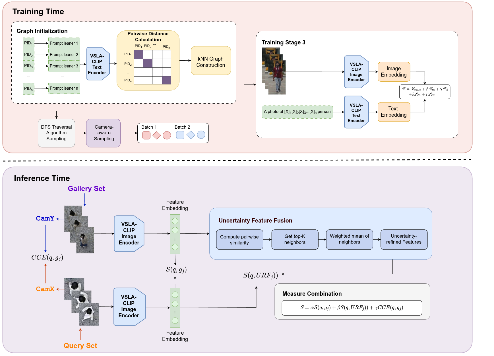

# 🏆 Top-2 Solution for the VReID-XFD Challenge at WACV 2026

This repository contains our **Top-2 solution** for the [VReID-XFD: Video-based Human Recognition at Extreme Far Distances challenge and workshop](https://www.it.ubi.pt/VReID-XFD/#intro) at **WACV 2026**.  
Our method is built upon the **VSLA-CLIP** framework and further extended with **DFGS-based hard sample mining**, a **multi-stage training pipeline**, and an **UFFM+CCE+MC evaluation workflow** for experiments on the **[DetReIDX](https://www.it.ubi.pt/DetReIDX/)** dataset.

---

## 📌 Overview

To address these challenges, our approach extends VSLA-CLIP with an additional Stage-3 training scheme using the DFGS sampler, together with an improved inference design that combines UFFM, CCE, and MC for extreme-distance video re-identification.



---

## 🧩 Environment Setup

```bash
conda create -n vslaclip_new python=3.8
conda activate vslaclip_new
conda install pytorch==1.8.0 torchvision==0.9.0 torchaudio==0.8.0 cudatoolkit=10.2 -c pytorch
pip install yacs timm scikit-image tqdm ftfy regex
```

---

## 🚀 Training

### 🔹 Stage 1 / Main Training

```bash
CUDA_VISIBLE_DEVICES=0 python train_reidadapter.py --config_file configs/adapter/vit_adapter.yml
```

### 🔹 Stage 3 Training

```bash
CUDA_VISIBLE_DEVICES=0 python train_reidadapter_stage3.py --stage2_weight output_original/VSLACLIP/ViT-B-16_60.pth
```

---

## 🧪 Evaluation

To evaluate all supported cases with the AMC-based evaluation script, run:

```bash
CUDA_VISIBLE_DEVICES=0 python evaluate_all_cases_amc.py \
  --config_file configs/adapter/vit_adapter.yml \
  --model_path output_original/VSLACLIPv4/ViT-B-16_stage3_final.pth
```

After evaluation, ranking results will be saved for challenge submission and further analysis.

---

## 🎓 Workshop / Challenge Information

**Workshop:** VReID-XFD: Video-based Human Recognition at Extreme Far Distances  
**Venue:** WACV 2026 Workshop  
**Dataset:** [DetReIDX](https://www.it.ubi.pt/DetReIDX/)

---

## 📬 Contact

For questions about this repository, please open an issue in this GitHub repository.

---

## 🙏 Acknowledgment

This work is built upon [VSLA-CLIP](https://github.com/FHR-L/VSLA-CLIP).  
We sincerely thank the original authors for their valuable contribution and open-source release.

---

## 📖 Citation

If you use this repository in your research, please cite the corresponding workshop paper when available.
